# PICO Arducam Examples

Table of Contents
=================

<!--ts-->
   * [PICO Arducam Examples](#pico-arducam-examples)
   * [Getting started](#getting-started)
   * [Quick Pico Setup](#quick-pico-setup)
      * [Person Detection](#person-detection)
         * [Test Person Detection](#test-person-detection)
         * [View output](#view-output)
      * [Micro Speech](#micro-speech)
         * [Test Micro Speech](#test-micro-speech)
         * [View output](#view-output-1)
      * [Magic Wand](#magic-wand)
         * [Test Magic Wand](#test-magic-wand)
         * [View output](#view-output-2)

<!-- Added by: mulong, at: 2021/03/19 15:49:33 CST -->

<!--te-->

# Getting started

See [Getting Started with the Raspberry Pi Pico](https://rptl.io/pico-get-started) and the README in the [pico-sdk](https://github.com/raspberrypi/pico-sdk) for information
on getting up and running.

# Quick Pico Setup
If you are developing for Raspberry Pi Pico on the Raspberry Pi 4B, or the Raspberry Pi 400, most of the installation steps
in this Getting Started guide can be skipped by running the setup script. You can get this script by doing the following:
```bash
git clone https://github.com/raspberrypi/pico-setup.git
```
Then run:
```bash
 pico-setup/pico_setup.sh
```
The script will:

- Create a directory called pico
- Install required dependencies
- Download the pico-sdk, pico-examples, pico-extras, and pico-playground repositories
- Define PICO_SDK_PATH, PICO_EXAMPLES_PATH, PICO_EXTRAS_PATH, and PICO_PLAYGROUND_PATH in your ~/.bashrc
- Build the blink and hello_world examples in pico-examples/build/blink and pico-examples/build/hello_world
- Download and build picotool (see Appendix B). Copy it to /usr/local/bin. • Download and build picoprobe (see Appendix A).
- Download and compile OpenOCD (for debug support)
- Download and install Visual Studio Code
- Install the required Visual Studio Code extensions (see Chapter 6 for more details)
- Configure the Raspberry Pi UART for use with Raspberry Pi Pico

Once it has run, you will need to reboot your Raspberry Pi,
```bash
sudo reboot
```

## Person Detection
- Download pico-tflmicro
```bash 
git clone https://github.com/ArduCam/pico-tflmicro.git
```
- Compile
```bash
cd pico-tflmicro
mkdir build 
cd build 
cmake ..
```
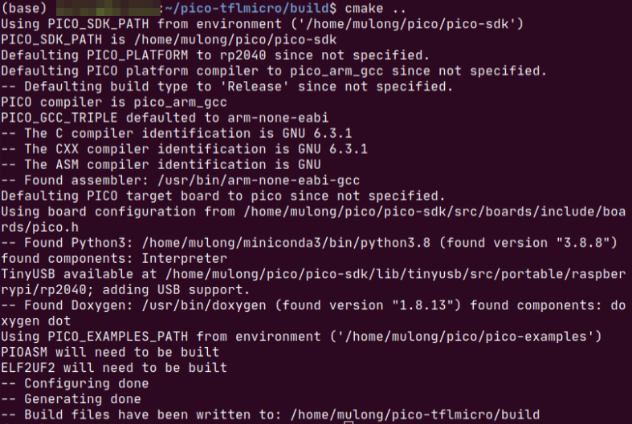

```bash
make
# or only make person_detection_int8
```
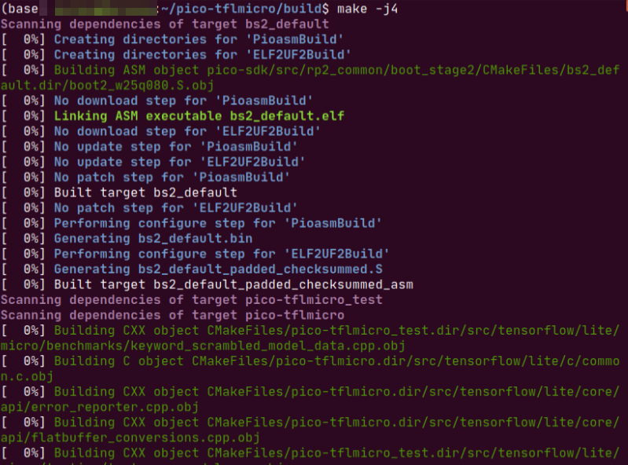
Then you will creat some files under pico-tflmicro/tflmicro/build/examples/person_detection path

Bin|Description
---|---
[person_detection_int8.uf2](tflmicro/bin/person_detection_int8.uf2) | This is the main program of person_detection, which can be dragged onto the RP2040 USB Mass Storage Device.
[person_detection_benchmark.uf2](tflmicro/bin/person_detection_benchmark.uf2) | This is the benchmark program of person_detection, you can use it to test the performance of person_detection on pico.
[image_provider_benchmark.uf2](tflmicro/bin/image_provider_benchmark.uf2) | This is the benchmark program of image_provider, you can use it to test the performance of image data acquisition.
**Tips: If you don't want to compile, you can use the above pre-built uf2 file, you only need to wire the hardware and download uf2 to the device.**

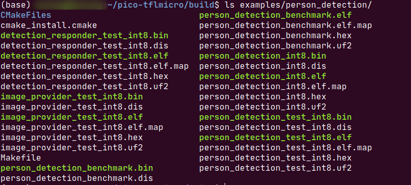

### Test Person Detection

App|Description
---|---
[person_detection_int8](tflmicro/examples/person_detection/main_functions.cpp) | This is a person detection demo.

- Hardware requirements

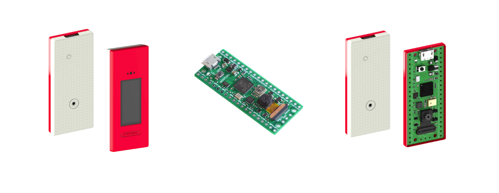

Learn more here: [pico4ml-an-rp2040-based-platform-for-tiny-machine-learning](https://www.arducam.com/pico4ml-an-rp2040-based-platform-for-tiny-machine-learning/)

- Load and run person_detection
  The simplest method to load software onto a RP2040-based board is by mounting it as a USB Mass Storage Device.
  Doing this allows you to drag a file onto the board to program the flash. Go ahead and connect the Raspberry Pi Pico to
  your Raspberry Pi using a micro-USB cable, making sure that you hold down the BOOTSEL button to force it into
  USB Mass Storage Mode.
  

If you are logged in via ssh for example, you may have to mount the mass storage device manually:
```bash
$ dmesg | tail
[ 371.973555] sd 0:0:0:0: [sda] Attached SCSI removable disk
$ sudo mkdir -p /mnt/pico
$ sudo mount /dev/sda1 /mnt/pico
```
If you can see files in /mnt/pico then the USB Mass Storage Device has been mounted correctly:
```bash
$ ls /mnt/pico/
INDEX.HTM INFO_UF2.TXT
```
Copy your person_detection_int8.uf2 onto RP2040:
```bash
sudo cp examples/person_detection/person_detection_int8.uf2 /mnt/pico
sudo sync
```

### View output

The person detection example outputs some information through usb, you can use minicom to view:
```bash
minicom -b 115200 -o -D /dev/ttyACM0
```
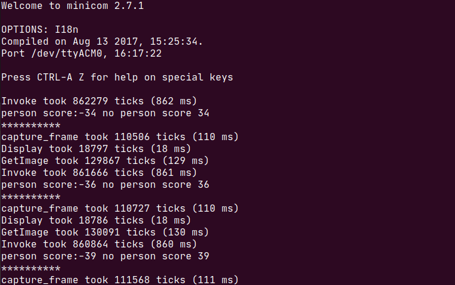

The person detection example also outputs the image data and person detection results to the UART, and you can see them directly on the screen.

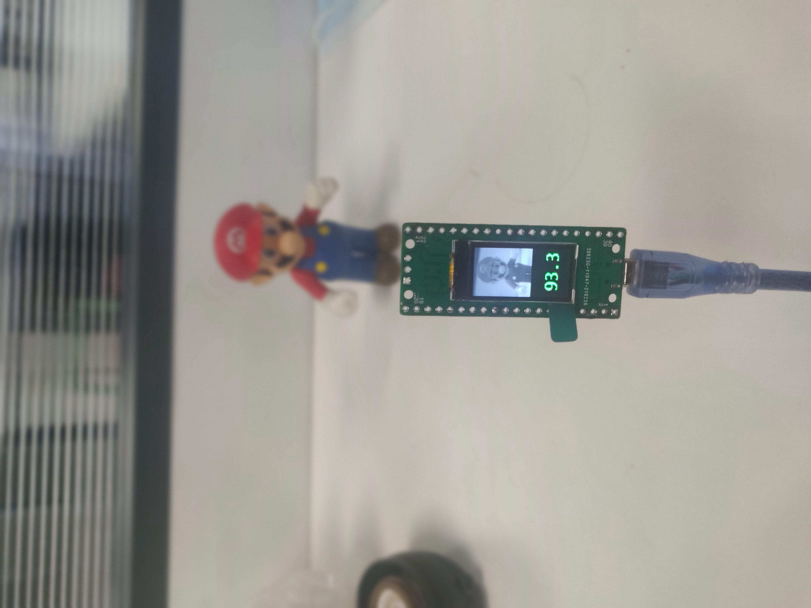
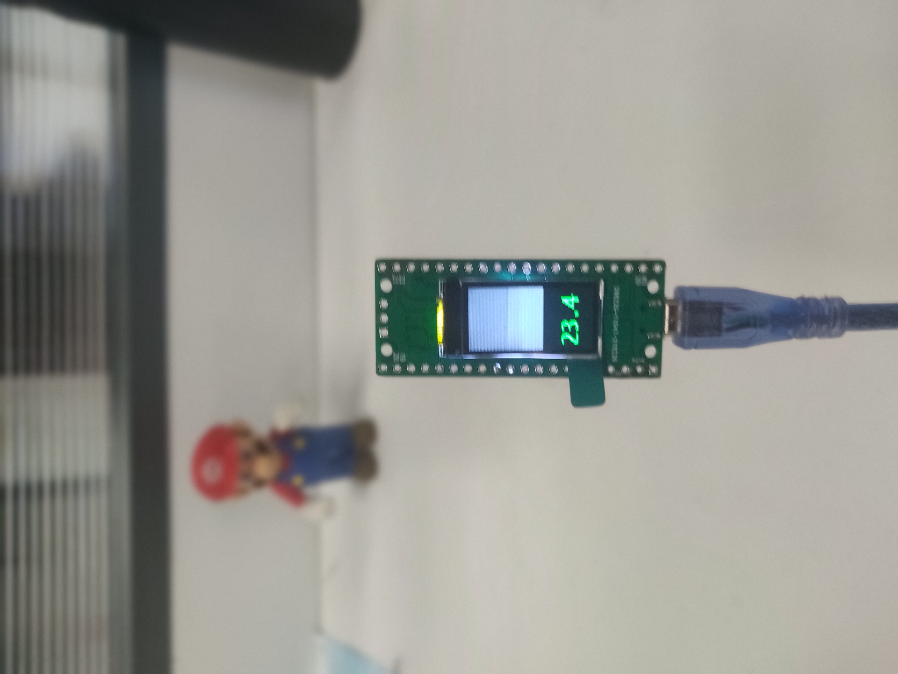

## Micro Speech

- Download pico-tflmicro

```bash 
git clone https://github.com/ArduCAM/pico-tflmicro.git
```

- Compile

```bash
cd pico-tflmicro
mkdir build 
cd build 
cmake ..
```


```bash
make
# or only make micro_speech
```


Then you will creat some files under pico-tflmicro/tflmicro/build/examples/micro_speech path

| Bin                                                         | Description                                                  |
| ----------------------------------------------------------- | ------------------------------------------------------------ |
| [micro_speech_int8.uf2](tflmicro/bin/micro_speech_int8.uf2) | This is the main program of micro_speech, which can be dragged onto the RP2040 USB Mass Storage Device. |

**Tips: If you don't want to compile, you can use the above pre-built uf2 file, you only need to wire the hardware and download uf2 to the device.**

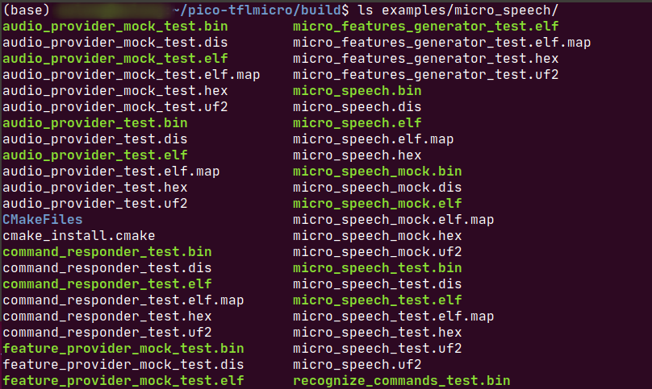

### Test Micro Speech

| App                                                          | Description                  |
| ------------------------------------------------------------ | ---------------------------- |
| [micro_speech](tflmicro/examples/micro_speech/main_functions.cpp) | This is a micro speech demo. |

- Hardware requirements


Learn more here: [pico4ml-an-rp2040-based-platform-for-tiny-machine-learning](https://www.arducam.com/pico4ml-an-rp2040-based-platform-for-tiny-machine-learning/)

- Load and run micro_speech
  The simplest method to load software onto a RP2040-based board is by mounting it as a USB Mass Storage Device.
  Doing this allows you to drag a file onto the board to program the flash. Go ahead and connect the Raspberry Pi Pico to
  your Raspberry Pi using a micro-USB cable, making sure that you hold down the BOOTSEL button to force it into
  USB Mass Storage Mode.
  

If you are logged in via ssh for example, you may have to mount the mass storage device manually:

```bash
$ dmesg | tail
[ 371.973555] sd 0:0:0:0: [sda] Attached SCSI removable disk
$ sudo mkdir -p /mnt/pico
$ sudo mount /dev/sda1 /mnt/pico
```

If you can see files in /mnt/pico then the USB Mass Storage Device has been mounted correctly:

```bash
$ ls /mnt/pico/
INDEX.HTM INFO_UF2.TXT
```

Copy your micro_speech.uf2 onto RP2040:

```bash
sudo cp examples/micro_speech/micro_speech.uf2 /mnt/pico
sudo sync
```

### View output

The micro speech example outputs some information through usb, you can use minicom to view:

```bash
minicom -b 115200 -o -D /dev/ttyACM0
```

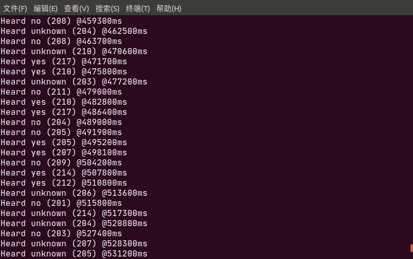

The micro speech example also outputs the results to the  screen.


## Magic Wand

- Download pico-tflmicro

```bash 
git clone https://github.com/ArduCAM/pico-tflmicro.git
```

- Compile

```bash
cd pico-tflmicro
mkdir build 
cd build 
cmake ..
```


```bash
make
# or only make  magic_wand
```


Then you will creat some files under pico-tflmicro/tflmicro/build/examples/magic_wand path

| Bin                                           | Description                                                  |
| --------------------------------------------- | ------------------------------------------------------------ |
| [magic_wand.uf2](tflmicro/bin/magic_wand.uf2) | This is the main program of magic_wand, which can be dragged onto the RP2040 USB Mass Storage Device. |

**Tips: If you don't want to compile, you can use the above pre-built uf2 file, you only need to wire the hardware and download uf2 to the device.**


### Test Magic Wand

| App                                                          | Description                |
| ------------------------------------------------------------ | -------------------------- |
| [magic_wand](tflmicro/examples/magic_wand/main_functions.cpp) | This is a magic wand demo. |

- Hardware requirements


Learn more here: [pico4ml-an-rp2040-based-platform-for-tiny-machine-learning](https://www.arducam.com/pico4ml-an-rp2040-based-platform-for-tiny-machine-learning/)

- Load and run magic_wand
  The simplest method to load software onto a RP2040-based board is by mounting it as a USB Mass Storage Device.
  Doing this allows you to drag a file onto the board to program the flash. Go ahead and connect the Raspberry Pi Pico to
  your Raspberry Pi using a micro-USB cable, making sure that you hold down the BOOTSEL button to force it into
  USB Mass Storage Mode.
  

If you are logged in via ssh for example, you may have to mount the mass storage device manually:

```bash
$ dmesg | tail
[ 371.973555] sd 0:0:0:0: [sda] Attached SCSI removable disk
$ sudo mkdir -p /mnt/pico
$ sudo mount /dev/sda1 /mnt/pico
```

If you can see files in /mnt/pico then the USB Mass Storage Device has been mounted correctly:

```bash
$ ls /mnt/pico/
INDEX.HTM INFO_UF2.TXT
```

Copy your magic_wand.uf2 onto RP2040:

```bash
sudo cp examples/magic_wand/magic_wand.uf2 /mnt/pico
sudo sync
```

### View output

The magic wand example outputs some information through usb, you can use minicom to view:

```bash
minicom -b 115200 -o -D /dev/ttyACM0
```


The magic wand example also outputs the results to the  screen.

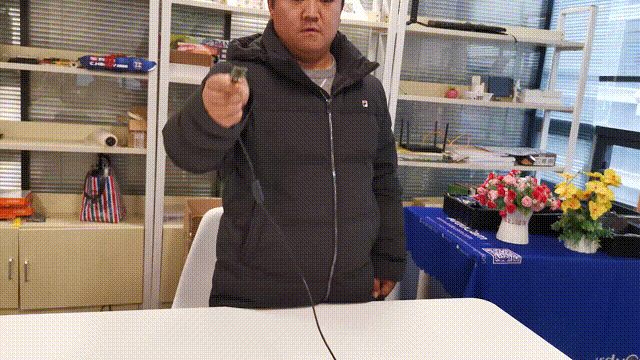

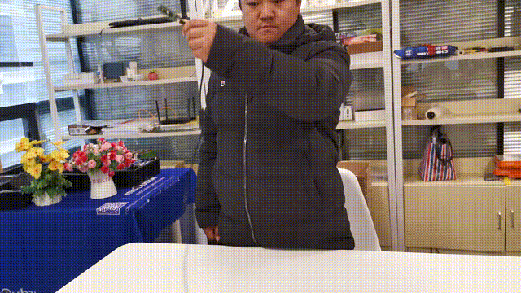

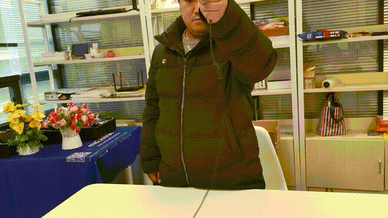